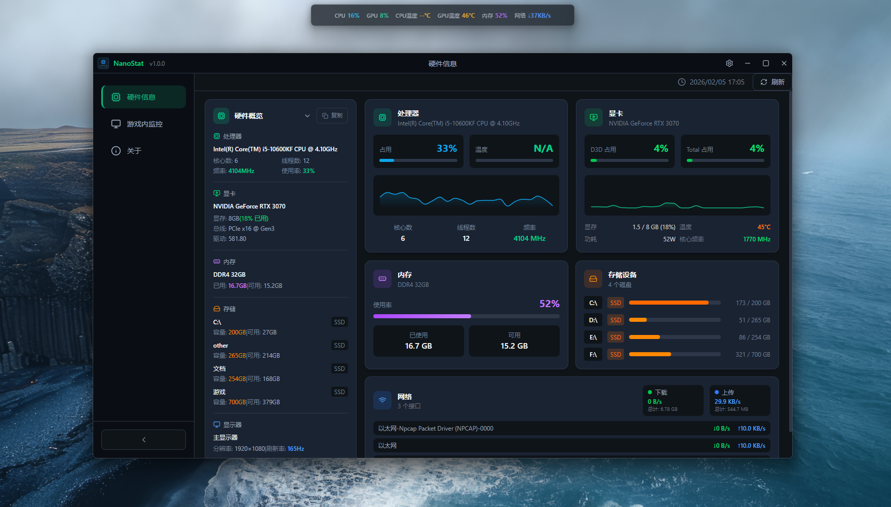

# NanoStat

<p align="center">
  
</p>

<p align="center">
  <a href="https://github.com/Chunyu33/nano-stat/releases"></a>
  
  
  
  
  
  
</p>

<p align="center">
  <a href="README.md">English</a> | <b>简体中文</b>
</p>

一款轻量、现代的 Windows 桌面硬件监控工具 —— 实时硬件信息展示与游戏内悬浮监控面板（类似游戏++ 的监控体验）。

## 功能特性

- **硬件概览** — CPU / GPU / 内存 / 磁盘 / 网络信息卡片化展示，带实时图表
- **游戏内悬浮监控** — 透明置顶面板，可配置位置、显示项、刷新间隔和透明度
- **智能 FPS 栏** — 检测到前台全屏游戏时才显示 FPS，非游戏状态自动隐藏
- **GPU 广泛支持** — NVIDIA 走 NVML（完整遥测）；AMD / Intel 走 WMI（基础信息）
- **CPU 温度** — 通过 WMI 热区读取（取决于主板/BIOS 是否暴露）
- **体验细节** — 自定义标题栏、可收缩侧边栏、深色/浅色主题、系统托盘

## 快速开始

环境要求：Windows 10/11、Node.js 18+、Rust 1.70+。

```bash
# 安装依赖
npm install

# 开发模式（Tauri）
npm run tauri dev

# 构建发布版本
npm run tauri build
```

> 如需完整的 NVIDIA 遥测数据，请安装官方显卡驱动（保证 NVML 可用）。

## 技术栈

- **前端**：React 19、TypeScript、TailwindCSS、Radix UI、Recharts
- **桌面框架**：Tauri 2
- **后端**：Rust —— sysinfo、systemstat、nvml-wrapper、wmi

## 文档

- [English README](./README.md)
- [更新日志](./CHANGELOG-zh.md) · [Changelog](./CHANGELOG.md)

## 贡献

欢迎提交 Bug 反馈、功能建议和 PR。建议先开 Issue 讨论方向，再提交 PR。

## 许可证

[MIT](./LICENSE)
