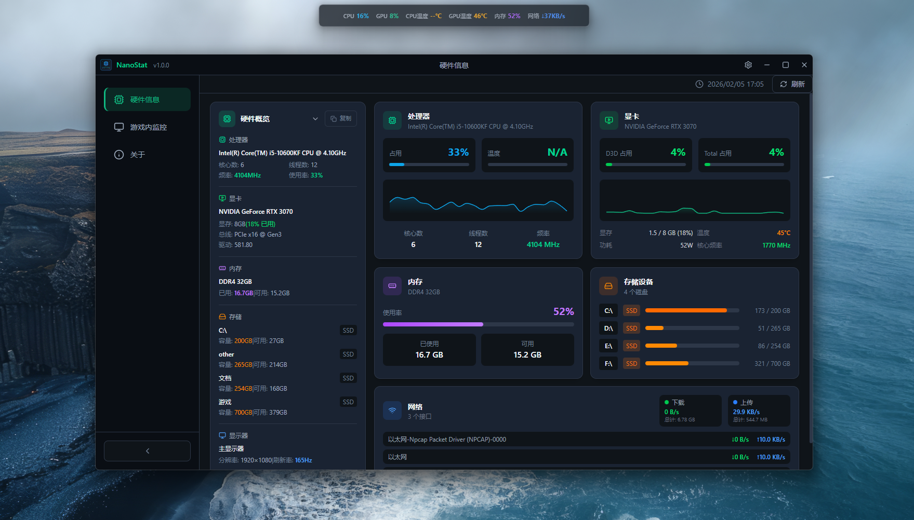

# NanoStat


一款轻量、现代的桌面硬件监控工具（类似游戏++的硬件监控体验），基于 **Tauri + Rust + React + TypeScript** 构建，提供实时硬件信息与游戏内悬浮监控面板（Overlay）。

## 截图



## 功能特性

- **硬件概览**
  - CPU / GPU / 内存 / 存储 / 网络等信息卡片化展示
  - 支持一键复制硬件信息（用于分享/提交问题）
- **游戏内监控（Overlay）**
  - 可配置位置：上/下/左/右中间
  - 可配置显示项、刷新间隔、透明度等
- **UI/体验**
  - 自定义标题栏（窗口控制按钮）
  - 侧边栏支持收缩并带过渡动画
  - 主题变量驱动（暗色/浅色适配）

## 技术栈

- **前端**
  - React 19 + TypeScript
  - TailwindCSS
  - Radix UI（Dialog/Select/Switch/Tabs 等）
  - Recharts（图表）
- **桌面框架**
  - Tauri 2
- **后端（Rust）**
  - sysinfo：CPU/内存/磁盘等基础信息
  - systemstat：网络统计
  - nvml-wrapper：NVIDIA GPU 信息（若系统安装 NVIDIA 驱动且 NVML 可用）
  - wmi：Windows 下获取 AMD/Intel（集显/独显）GPU 的基础信息

## GPU 支持说明

当前 GPU 信息采集策略：

- **NVIDIA**：优先使用 NVML（支持更完整：使用率/温度/显存等）。
- **AMD / Intel（含集显）**：使用 WMI 获取基础信息（名称/显存容量/驱动版本等）。

说明：在 Windows 上，AMD/Intel 的 **实时使用率、温度、功耗** 等数据通常需要厂商 SDK（如 ADL/Intel GPU 工具链）。当前实现以“基础信息可用”为目标。

## 环境要求

- **系统**：Windows 10/11（当前主要针对 Windows 适配）
- **Node.js**：18+
- **Rust**：建议 1.70+（或与本机 Tauri 2 工具链匹配）

> 如需完整 NVIDIA GPU 数据：建议安装官方显卡驱动（保证 NVML 可用）。

## 快速开始

### 安装依赖

```bash
npm install
```

### 开发模式（Tauri）

```bash
npm run tauri dev
```

### 构建发布版本

```bash
npm run tauri build
```

### 仅前端预览（可选）

```bash
npm run dev
```

## 项目结构

```text
nano-stat/
├── public/
│   └── assets/
│       └── show.png                 # 项目截图
├── src/                              # 前端源码
│   ├── components/                   # React 组件
│   │   └── hardware/                 # 硬件信息卡片组件
│   ├── hooks/                        # 自定义 Hooks（主题/设置/版本等）
│   ├── pages/                        # 页面组件（硬件信息/游戏内监控/关于）
│   ├── styles/                       # 样式文件
│   └── types/                        # TypeScript 类型定义
├── src-tauri/                        # Rust 后端源码
│   └── src/
│       ├── hardware/                 # 硬件信息采集模块
│       │   ├── cpu.rs                # CPU 信息
│       │   ├── gpu.rs                # GPU 信息（NVIDIA NVML + Windows WMI 回退）
│       │   ├── memory.rs             # 内存信息
│       │   ├── disk.rs               # 磁盘信息
│       │   ├── network.rs            # 网络信息
│       │   └── types.rs              # 数据类型定义
│       └── lib.rs                    # Tauri 命令入口
└── overlay.html                      # 悬浮窗口入口页面
```

## 架构概览

- **前端（React）**
  - 通过 `@tauri-apps/api` 调用后端命令获取硬件数据
  - 使用 CSS 变量实现主题色/边框/背景一致性
- **后端（Rust/Tauri）**
  - 周期性采集硬件信息并以结构化数据返回给前端
  - GPU 模块：NVIDIA 优先 NVML；不可用时回退到 WMI（AMD/Intel 基础信息）

## 贡献

欢迎 PR / Issue：

- **Bug 反馈**：请附上截图、系统版本、GPU 型号、复现步骤
- **功能建议**：描述使用场景与预期交互
- **代码贡献**：建议先开 Issue 讨论方向，再提交 PR

## 许可证

本项目基于 **MIT License** 开源。
